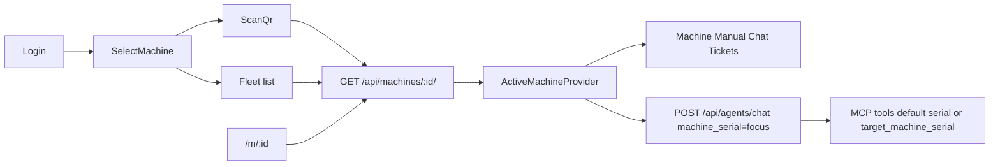

# QR focus machine and fleet-aware chat

## Product rules

- After login, the user **must** choose a machine: **scan QR** or **pick from `GET /api/machines/`**.
- That choice is the **focus machine** for the SPA. Machine, Manual, and Chatbot show only that unit. Maintenance tickets default-filter to it (with an “all company tickets” control). Orders stay company-wide: they are not keyed to a machine ([`Order`](Backend/apps/quotes/models.py) has no `machine_id`; only `QuoteLine` does).
- Chat still posts `machine_serial` = focus. Unmarked questions refer to that machine. Named other serials in the same company are allowed via tools, not via a second bot.
- Authorization never comes from the browser store. Every API/MCP call still re-checks `request.user.company_id` / `get_owned_machine`.



## 1. Focus state (frontend)

Add [`frontend/src/hooks/useActiveMachine.tsx`](frontend/src/hooks/useActiveMachine.tsx) wrapped next to `AuthProvider` in [`frontend/src/main.tsx`](frontend/src/main.tsx).

Persist a **pointer only** in `sessionStorage` (tab lifetime; plant-tablet friendly), key `arol.focus.<username>`:

```ts
{ serialNumber: string, machineId: string, source: 'qr' | 'list' | 'link' }
```

Hydrate React state from that on load. On logout, clear it next to [`clearPersistedChat`](frontend/src/api/chatStorage.ts) in [`useAuth.tsx`](frontend/src/hooks/useAuth.tsx). If Storage throws, keep in-memory state and send the user back to `/select`.

Add `RequireMachineRoute`: if authenticated but no focus, `<Navigate to="/select" state={{ from }} />`.

## 2. Resolve endpoint and deep link

In [`Backend/apps/machines/views.py`](Backend/apps/machines/views.py) `machine_detail`, accept **serial or `machineId`** against the owned queryset (explicit 403/404 if it exists for another company — same pattern as [`get_owned_machine`](Backend/apps/mcp_server/scoping.py)). Keep URL [`path('<str:serial_number>/')`](Backend/apps/machines/urls.py) but treat the param as an identifier.

Frontend: [`fetchMachine(id)`](frontend/src/api/machines.ts) unchanged path. New route `/m/:id` (protected): fetch, `setFocus`, then `navigate` to `from` or `/machine`. Logged-out QR hits `/` then `from=/m/17478` via existing [`ProtectedRoute`](frontend/components/ProtectedRoute.tsx) (`from` should include pathname).

QR payload (AROL): `https://<host>/m/<serial>` or `/m/<machineId>`.

## 3. Welcome → select → scan

- [`WelcomePage.tsx`](frontend/components/WelcomePage.tsx): logged-in users go to `/select` (or `from` if it is `/m/...`), not straight to `/machine`.
- New `SelectMachinePage`: two actions — Scan QR, or list from `useMachines()`. List calls `fetchMachine(serial)` then `setFocus` and navigates to `/machine`.
- New `ScanQrPage`: camera scan with **`html5-qrcode`** (Safari/iOS plant phones), plus paste-URL / image-file fallback. Parse path `/m/:id` or a bare serial/`MCH-…` id, then the same resolve + `setFocus` path. Camera needs HTTPS (or localhost).

[`NavBar.tsx`](frontend/components/NavBar.tsx): show focus serial + “Change machine” → `/select`.

[`App.tsx`](frontend/src/App.tsx) routes: `/select`, `/scan`, `/m/:id`, and wrap `/machine`, `/manual`, `/chatbot`, `/orders`, `/maintenance` with `RequireMachineRoute`.

## 4. Pages consume focus (drop per-page pickers)

- [`MachineInfoPage.tsx`](frontend/components/MachineInfoPage.tsx) / [`ManualPage.tsx`](frontend/components/ManualPage.tsx): `useMachine(focus.serialNumber)` only; remove local `<select>` pickers.
- [`ChatbotPage.tsx`](frontend/components/ChatbotPage.tsx): replace [`useDefaultMachine()`](frontend/src/hooks/useMachine.ts) with focus serial. Welcome copy and [`chatStorage`](frontend/src/api/chatStorage.ts) already key by serial — switching machines naturally starts/restores that serial’s thread.
- [`MaintenanceTicketsPage.tsx`](frontend/components/MaintenanceTicketsPage.tsx): default `useClientTable` filter `serialNumber === focus`; toggle “All company tickets”.
- Leave [`OrdersPage.tsx`](frontend/components/OrdersPage.tsx) company-wide (data model).

## 5. Chat: focus default + fleet override

**Prompt (shared, not a new agent).** After `load_machine_context` succeeds, append a focus block to the system prompt in [`agent_kit.run_tool_calling_loop`](Backend/apps/agents/agent_kit.py) (same place as `_ACCESS_DENIAL_INSTRUCTION`): current model/serial/plant; unmarked questions = this machine; other company machines only after `list_customer_machines`; never invent serials.

**Tools.** In `mcp_tool()`:

- Keep stripping `customer_id` and the request `machine_serial` from the LLM schema (`customer_id` never comes from the model).
- For `requires_machine_scope` tools, expose optional `target_machine_serial`. Resolve `serial = target_machine_serial or injected_focus`, then `registry.invoke` as today (re-validated in [`scoping.py`](Backend/apps/mcp_server/scoping.py)).

Attach `list_customer_machines` to all four agents via `mcp_tool` inside each `_build_tools` (it is `shared`, so `build_agent_tools` currently excludes it).

Update tests in [`Backend/apps/agents/tests.py`](Backend/apps/agents/tests.py):

- `target_machine_serial` is on the LLM schema; `customer_id` / `machine_serial` are not.
- Each agent’s tool set includes `list_customer_machines`.
- Invoke with a foreign serial still errors FORBIDDEN.

Optional: a few Django tests that `GET /api/machines/MCH-0004/` and `GET /api/machines/<serial>/` both work for the owner.

## Out of scope

- Persisting focus on the Django user row.
- `target_serial` as a second HTTP field on `/api/agents/chat/` (body stays one focus serial; override is tool-level).
- Filtering orders by quote-line machine.
- Generating printable QR assets (any library can encode `/m/<serial>` later).
