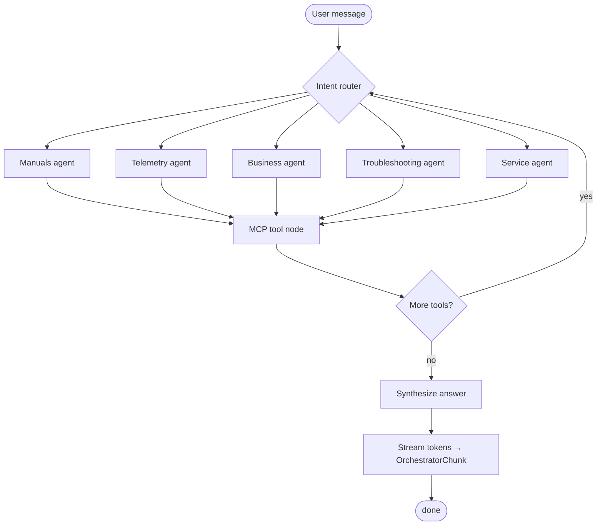

# Orchestrator Implementation — Stub Today, LangGraph Tomorrow

**Audience:** Esteban, frontend developers, and the LangGraph partner building the production orchestrator.

**Related docs:**
- [ORCHESTRATOR_GUIDE.md](./ORCHESTRATOR_GUIDE.md) — MCP tool catalog, schemas, and agent routing
- [PROJECT_CONTEXT.md](../PROJECT_CONTEXT.md) — monorepo layout and end-to-end flow
- [.cursorrules](../.cursorrules) — architectural rules (MCP-first, tenant scoping, port pattern)

---

## 1. Purpose

The chat stack is wired so the **frontend and Django API are stable** while the orchestration brain can be swapped:

| Backend | Env | Status |
|---------|-----|--------|
| **StubOrchestrator** | `ORCHESTRATOR_BACKEND=stub` | **Implemented** — local dev, CI, frontend integration |
| **LangGraphOrchestrator** | `ORCHESTRATOR_BACKEND=langgraph` | **Placeholder** — partner-owned planner & tool loop |

Both backends implement the same **`OrchestratorPort`**. Django `views.py` never imports LangGraph internals — only the factory.

---

## 2. End-to-end flow

```
React ChatbotPage
    │  POST /api/agents/chat/  (session cookie + CSRF)
    │  body: { message, machine_serial? }
    ▼
apps/agents/views.py
    │  auth check (Django session)
    │  resolve machine_serial (must belong to request.user)
    │  customer_id = request.user.username
    ▼
factory.get_orchestrator()
    │  stub  → StubOrchestrator
    │  langgraph → LangGraphOrchestrator (TBD)
    ▼
OrchestratorPort.run(...)  →  Iterator[OrchestratorChunk]
    │  tool nodes call MCP only
    ▼
apps/mcp_server/registry.invoke(tool_name, params)
    ▼
machines / rag_engine / … (behind tools, never from graph directly)
    │
    ▼
SSE stream back to browser (token | tool | done | error)
```

**Key principle:** The orchestrator (stub or LangGraph) is a **consumer of MCP tools**, not a direct consumer of Django ORM or SQL.

---

## 3. File map (`Backend/apps/agents/`)

| File | Responsibility |
|------|----------------|
| `ports.py` | `OrchestratorPort` protocol, `OrchestratorChunk`, `ChatAttachmentRef` |
| `stub_orchestrator.py` | Local simulator — real MCP calls + optional Anthropic streaming |
| `langgraph_orchestrator.py` | Thin adapter to partner graph (raises `NotImplementedError` today) |
| `factory.py` | Selects backend from `ORCHESTRATOR_BACKEND` |
| `views.py` | HTTP auth, machine scoping, SSE encoding |
| `urls.py` | `POST /api/agents/chat/` |
| `tests.py` | Stub + SSE endpoint tests (canned path, no API key required) |

Frontend:

| File | Responsibility |
|------|----------------|
| `frontend/src/api/chat.ts` | POST + SSE parser |
| `frontend/src/hooks/useChat.ts` | Streaming hook with incremental `onToken` |
| `frontend/components/ChatbotPage.tsx` | Chat UI wired to real backend |

---

## 4. OrchestratorPort contract

Every backend must implement:

```python
def run(
    self,
    *,
    customer_id: str,       # Django username (from session — not client-supplied in prod)
    machine_serial: str,    # e.g. "A3279"
    message: str,
    attachments: list[ChatAttachmentRef] | None = None,
) -> Iterator[OrchestratorChunk]:
    ...
```

### Chunk types

| `type` | Fields | Purpose |
|--------|--------|---------|
| `token` | `content` | Streamed assistant text (frontend appends to message) |
| `tool` | `tool`, `data` | MCP tool name + full invoke envelope (`status`, `data` or `message`) |
| `error` | `message` | Non-fatal or fatal error surfaced to client |
| `done` | — | End of run (views stop streaming after `done` or `error`) |

**LangGraph adapter:** map graph events (LLM tokens, tool start/end, graph completion) onto these four chunk types. Do not invent a parallel event protocol — the frontend already consumes this shape.

---

## 5. HTTP / SSE API

### Request

```
POST /api/agents/chat/
Content-Type: application/json
Cookie: sessionid=…; csrftoken=…
X-CSRFToken: …

{
  "message": "Alarm E042 star-wheel jam",
  "machine_serial": "A3279"   // optional — defaults to user's first owned machine
}
```

### Response

```
Content-Type: text/event-stream
Cache-Control: no-cache

data: {"type": "tool", "tool": "get_machine_info", "data": {"status": "ok", "data": {...}}}

data: {"type": "tool", "tool": "search_manual", "data": {"status": "ok", "data": {...}}}

data: {"type": "token", "content": "Based on "}

data: {"type": "token", "content": "your machine…"}

data: {"type": "done"}
```

### Auth & scoping (Django edge)

- **401** if not logged in.
- **404** if the user has no machines or `machine_serial` is not owned by them.
- **`customer_id` is never taken from the request body** — it comes from `request.user.username` to prevent cross-tenant spoofing.
- MCP tools **re-validate** `customer_id` + `machine_serial` at invocation time (defense in depth).

---

## 6. Stub orchestrator (current implementation)

The stub is intentionally **simple and deterministic**. It exists to:

1. Exercise the full path: frontend → Django → orchestrator → MCP → SSE.
2. Validate tenant scoping before the partner graph lands.
3. Run in CI without LLM keys (`ANTHROPIC_API_KEY` unset → canned token stream).

### What it does today

1. **Always** calls `get_machine_info` with scoped params.
2. **Optionally** calls one follow-up tool based on keyword rules in the user message:

   | Keywords (examples) | Tool |
   |---------------------|------|
   | alarm, error, E042, jam, troubleshoot | `search_manual` |
   | manual, how to, procedure, torque | `search_manual` |
   | temperature, cycle, telemetry, pressure | `query_telemetry` |
   | spare, part, order | `list_spare_parts` |
   | ticket, technician, support | `create_ticket` |

3. Builds a prompt from user message + MCP JSON results.
4. Streams a reply:
   - **With `ANTHROPIC_API_KEY`:** Anthropic `messages.stream` (model from `ANTHROPIC_MODEL`).
   - **Without API key:** word-by-word canned summary mentioning tools called.

### What the stub does *not* do (by design)

- Multi-step planning or agent routing (that's LangGraph's job).
- LLM-chosen tool selection (uses regex, not an agent loop).
- Attachment upload/analysis (acknowledged in prompt only).
- Conversation memory / session persistence.
- Token/cost accounting (planned in `apps/core`).

---

## 7. MCP integration

### How orchestrators must call tools

**In-process (required for LangGraph nodes and stub):**

```python
from apps.mcp_server import registry

result = registry.invoke(
    "get_machine_info",
    {"customer_id": customer_id, "machine_serial": machine_serial},
)

if result["status"] == "ok":
    machine = result["data"]["machine"]
else:
    # result["message"], result.get("code")
    ...
```

**Discovery:**

```python
tools = registry.list_tools()                  # all tools
tools = registry.list_tools(agent="manuals")   # agent tools + shared
```

Each listed tool includes `input_schema` / `output_schema` (Pydantic JSON Schema) — reuse these for LLM tool binding; do not duplicate field lists in the graph.

### HTTP debug (local only)

See [ORCHESTRATOR_GUIDE.md §1](./ORCHESTRATOR_GUIDE.md#1-how-agents-talk-to-tools) for `GET /api/mcp/tools/` and `POST /api/mcp/tools/<name>/invoke/`. These wrap the same `registry.invoke` and are gated by `MCP_HTTP_INVOKE_ENABLED`.

### Hard rules

1. **Every tenant-scoped call** includes `customer_id` and `machine_serial` (except `echo`, `list_customer_machines`).
2. **No ORM/SQL inside the graph** — if you need data, call or add an MCP tool.
3. Treat `stub: true` in tool payloads as contract-stable placeholders until backends go live.
4. On failure, propagate the MCP envelope — do not swallow errors into free-text-only responses.

### Suggested graph tool node

```python
def mcp_tool_node(state: dict) -> dict:
    name = state["pending_tool"]
    params = {
        "customer_id": state["customer_id"],
        "machine_serial": state["machine_serial"],
        **state.get("tool_args", {}),
    }
    result = registry.invoke(name, params)
    return {"last_tool_result": result, "messages": [...]}  # graph-specific
```

Full tool catalog and agent ownership: [ORCHESTRATOR_GUIDE.md §3–§7](./ORCHESTRATOR_GUIDE.md).

---

## 8. Expectations for the LangGraph orchestrator

The partner graph replaces `StubOrchestrator` behind the same port. Django, frontend, and MCP contracts **must not change**.

### Responsibilities (LangGraph owns)

| Area | Expectation |
|------|-------------|
| **Planning & routing** | Decide which agent/tool(s) to run from user intent (manuals, telemetry, business, troubleshooting, service). |
| **Tool loop** | Multi-step: call tool → interpret result → call again or answer. |
| **Prompts & personas** | Per-agent system prompts; keep machine context in state. |
| **Streaming** | Stream LLM tokens as `OrchestratorChunk(type="token")`; emit `tool` chunks when MCP invokes complete. |
| **State** | Graph state always carries `customer_id` + `machine_serial` on every node. |
| **Errors** | Map graph/tool failures to `error` chunks; always end with `done` (or `error` then `done`). |

### Non-responsibilities (Django / MCP own)

| Area | Owner |
|------|-------|
| HTTP, sessions, CSRF | `apps/agents/views.py` |
| Machine ownership check before orchestrator run | `views.py` + `machines` |
| Tool implementations & tenant re-validation | `apps/mcp_server` |
| Persistence (tickets, RAG, telemetry) | respective Django apps, exposed via MCP |

### Recommended graph shape (starting point)



This is illustrative — the partner owns node names, conditional edges, and sub-graphs. The **integration surface** is fixed: `OrchestratorPort` + `registry.invoke`.

### Implementing `LangGraphOrchestrator`

File: `Backend/apps/agents/langgraph_orchestrator.py`

```python
class LangGraphOrchestrator:
    def run(self, *, customer_id, machine_serial, message, attachments=None):
        # 1. Build initial graph state
        # 2. Run graph (sync stream or async → sync iterator)
        # 3. For each graph event:
        #      - LLM token     → yield OrchestratorChunk(type="token", content=...)
        #      - tool finished → yield OrchestratorChunk(type="tool", tool=..., data=result)
        # 4. yield OrchestratorChunk(type="done")
        ...
```

Graph package may live in `apps/agents/graphs/` or an external installable package — the adapter hides that choice.

### Switching backends

```bash
# Local / CI (default)
ORCHESTRATOR_BACKEND=stub

# When partner graph is ready
ORCHESTRATOR_BACKEND=langgraph
```

No frontend or URL changes required.

---

## 9. Environment variables

Set in repo-root `.env` (see `.env.example`):

| Variable | Default | Purpose |
|----------|---------|---------|
| `ORCHESTRATOR_BACKEND` | `stub` | `stub` \| `langgraph` |
| `ANTHROPIC_API_KEY` | *(empty)* | Stub LLM streaming; omit in CI for canned replies |
| `ANTHROPIC_MODEL` | `claude-haiku-4-5-20251001` | Model for stub Anthropic path |

LangGraph will likely add its own keys (OpenAI, Anthropic, etc.) — keep them in `.env`, never commit secrets.

---

## 10. General recommendations

### For the LangGraph partner

1. **Bind tools from MCP schemas** — `registry.list_tools()` or `SomeInput.model_json_schema()`; single source of truth.
2. **Always pass scope** — copy `customer_id` and `machine_serial` from graph state into every scoped tool call.
3. **Emit tool chunks** — helps debugging and future UI (tool-call transparency); stub already does this.
4. **Handle stub tools gracefully** — many tools return `stub: true`; still useful for graph flow testing.
5. **Prefer small, testable nodes** — one MCP call per tool node; keep routing separate from execution.
6. **Do not bypass MCP** for “quick” DB reads — adds hidden coupling and breaks tenant guarantees.
7. **Stream early** — yield tokens as they arrive; Django SSE is already unbuffered-friendly.
8. **Idempotent tool args** — validate with Pydantic before invoke; registry returns structured `VALIDATION_ERROR`.

### For Esteban / platform work

1. **Keep views thin** — new orchestration features go behind `OrchestratorPort`, not in `views.py`.
2. **Extend MCP first** — new capabilities = new tool in `mcp_server` + doc update in ORCHESTRATOR_GUIDE.
3. **Attachment pipeline** — when ready, extend `chat_view` to accept uploads and pass `ChatAttachmentRef` (or richer types) to the port; stub already accepts the type.
4. **Session / audit** — optional `agents` models for conversation history; orchestrator remains stateless or loads history via a future MCP tool.
5. **Cost tracking** — hook token counts in `apps/core` inside the LangGraph adapter, not scattered in views.

### For frontend

1. Chat uses **session auth** — same cookies as `/api/auth/` and `/api/machines/`.
2. Vite dev proxy forwards `/api` → Django `8000`.
3. Only `token` chunks update visible assistant text today; `tool` chunks are available for future UI (e.g. “Searching manual…”).

---

## 11. Local verification

```bash
# Backend
cd Backend
python manage.py seed_demo_machine    # user: demo / password: demo
python manage.py test apps.agents
python manage.py runserver

# Frontend (separate terminal)
cd frontend
npm run dev
# Login → /chatbot → send a message
```

**Example curl (after login cookie):**

```bash
curl -N -X POST http://127.0.0.1:8000/api/agents/chat/ \
  -H "Content-Type: application/json" \
  -H "Cookie: sessionid=…; csrftoken=…" \
  -H "X-CSRFToken: …" \
  -d '{"message": "What machine is this?", "machine_serial": "A3279"}'
```

---

## 12. Partner handoff checklist

When delivering the LangGraph orchestrator, confirm:

- [ ] `LangGraphOrchestrator` implements `OrchestratorPort.run()` with the four chunk types.
- [ ] All tool calls go through `registry.invoke` (no direct ORM in graph nodes).
- [ ] `customer_id` + `machine_serial` present in graph state for every step.
- [ ] `ORCHESTRATOR_BACKEND=langgraph` passes existing `apps.agents` tests (extend tests as needed).
- [ ] Streaming works through `POST /api/agents/chat/` with demo user + A3279.
- [ ] Errors produce `error` + `done` chunks, not raw stack traces to the client.
- [ ] Tool schemas documented or discoverable via `registry.list_tools()`.
- [ ] README or graph package documents env vars and how to run locally.

---

## 13. What's next

| Item | Owner | Notes |
|------|-------|-------|
| LangGraph graph + adapter | Partner | Drop-in via `langgraph_orchestrator.py` |
| Attachment upload in chat API | Platform | Extend `chat_view` + port |
| Conversation persistence | Platform | Optional `agents` models or MCP tool |
| Token/cost logging | Platform | `apps/core` |
| Real RAG Vector DB | Platform | **Done**: `search_manual` lives with Qdrant + FastEmbed |
| Real telemetry / ticket integration | Platform | Wire remaining stub tools (`query_telemetry`, `create_ticket`, `list_spare_parts`) |

The stub proves the pipes work; LangGraph replaces the **brain** without rewiring the **plumbing**.
