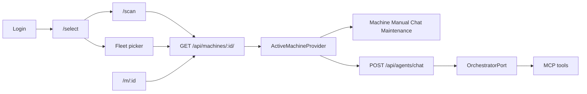

# QR machine focus — partner handoff

This document describes the **QR / machine-selection flow** added to the Arol Customer Platform frontend and how it connects to the existing **OrchestratorPort → LangGraph / Stub → MCP** stack.

It is written for integration partners who need to understand what changed, where scope is enforced, and what is (and is not) persisted in the browser.

---

## 1. What we built (summary)

Before this work, each page (Machine, Manual, Chatbot) could pick among the user’s fleet independently, and chat defaulted to the **first** owned machine from the API.

Now the app follows the Arol dataset guidance: an operator identifies **one machine in front of them** (QR on the plant floor or an explicit pick from their company fleet). That machine becomes the **focus machine** for the whole SPA until they change it.

| Area | Behavior |
|------|----------|
| **Onboarding** | After login → `/select`: scan QR or pick from fleet list |
| **Deep link** | `/m/<serial>` or `/m/<machineId>` (same as a QR URL payload) |
| **Scoped pages** | Machine, Manual, Chatbot, Maintenance (default filter) require focus |
| **Orders** | Still company-wide (data model); route still requires focus so nav stays consistent |
| **Nav** | Minimal bar (brand + profile + sign out) until focus exists; full menu after |
| **Chat** | Every turn sends `machine_serial` = focus; agents can still query **other owned machines** via MCP tools |
| **Security** | Focus in the browser is a **UI pointer only**; Django session + MCP re-validate ownership on every request |

---

## 2. End-to-end flow



### Ways to set focus

1. **Fleet list** (`/select`) — user taps a machine → `GET /api/machines/<serial>/` → focus saved.
2. **QR scan** (`/scan`, opens in a new tab) — camera, paste URL, or upload image → same resolve API.
3. **Deep link** (`/m/:id`) — QR encodes e.g. `https://<host>/m/17478`; after login, machine is resolved and focus is set.

The backend lookup accepts **serial number or `machineId`** and returns 403 if the machine exists but belongs to another company (`Backend/apps/machines/views.py`).

### QR payload format

Recommended URL (also what we parse in the scanner):

```text
https://<your-host>/m/<serialNumber>
https://<your-host>/m/<machineId>
```

Bare serials (e.g. `A3279`) are also accepted by the scanner parser.

---

## 3. Focus machine in the frontend

### React context

`ActiveMachineProvider` (`frontend/src/hooks/useActiveMachine.tsx`) holds:

```ts
{
  serialNumber: string
  machineId: string
  source: 'qr' | 'list' | 'link'
}
```

All scoped pages read `focus.serialNumber` instead of local pickers or `useDefaultMachine()`.

### Route guards

`MachineFocusGate` (`frontend/components/RequireMachineRoute.tsx`) redirects authenticated users **without focus** to `/select`, preserving the intended destination in `location.state.from` so they can land there after choosing a machine.

---

## 4. How the orchestrator and MCP get machine context

The browser **does not** send focus to the backend as a separate “session field.” Chat and tools use the same contract as before, with the focus serial passed explicitly on each chat turn.

### Chat HTTP edge

`POST /api/agents/chat/` body (from `useChatStream`):

```json
{
  "message": "...",
  "machine_serial": "<focus serial>",
  "session_id": "<optional, for thread continuity>"
}
```

In `Backend/apps/agents/views.py`:

- `customer_id` = **`request.user.username`** (never from the client body).
- `machine_serial` = body field, validated against machines owned by the user’s company.
- Invalid serial → **404**. Serial/machineId that exists but belongs to another company → **403**.

So after a QR scan, the **frontend focus serial** is what the orchestrator receives on every message.

### OrchestratorPort

```python
orchestrator.run(
    customer_id=customer_id,
    machine_serial=machine_serial,
    message=message,
    session_id=session_id,
)
```

LangGraph uses `thread_id = f"{customer_id}:{session_id}"` for conversation memory (`langgraph_orchestrator.py`). The **focus serial is per request**, not stored inside the LangGraph checkpoint as a separate “QR session” — each turn carries the current focus from the client.

### Per-turn agent pipeline

For each specialized agent (manuals, telemetry, troubleshooting, orders):

1. **`load_machine_context`** — calls MCP `get_machine_info` with `(customer_id, machine_serial)` and streams a tool chunk to the UI.
2. **System prompt** — appends a **focus preamble** built from that machine record (model, serial, plant): unmarked questions refer to this machine.
3. **Tool loop** — MCP tools are built with `customer_id` / `machine_serial` **injected server-side**; the LLM never supplies tenant id.

### MCP tool scoping

- Every scoped tool still receives `customer_id` + `machine_serial` through `registry.invoke`, re-validated in `apps/mcp_server/scoping.py`.
- **Fleet-aware chat:** scoped tools expose an optional LLM-visible `target_machine_serial`. If omitted, the focus serial from the chat request is used. If set, MCP checks that serial is owned by the same customer.
- All agents also get **`list_customer_machines`** so the model can answer “what machines do I have?” or resolve another serial the user names explicitly.

**Important:** QR/focus does **not** replace tenant checks. It only chooses the **default** serial for ambiguous questions (“this alarm”, “the manual”).

---

## 5. `sessionStorage` — focus machine pointer

Implementation: `frontend/src/api/machineFocus.ts`

| Property | Value |
|----------|--------|
| **Key** | `arol.focus.<username>` |
| **Store** | `sessionStorage` (per browser tab) |
| **Payload** | `{ serialNumber, machineId, source }` only — not full machine JSON, not auth |
| **Cleared on** | Logout (`useAuth` → `clearMachineFocus`) |
| **Cross-tab** | `storage` event in `ActiveMachineProvider` syncs focus when another tab (e.g. QR scan popup) writes the same key |

### What sessionStorage is / is not

- **Is:** a small client-side pointer so the SPA remembers which machine the operator selected in **this tab**.
- **Is not:** authorization, a cache of fleet data, or orchestrator state. Pages still call `GET /api/machines/<serial>/` for full records.
- **Lifetime:** cleared when the tab closes (unlike chat below). Good for shared plant tablets: closing the tab forgets focus.

If `sessionStorage` is unavailable, focus still works in memory for the session; guards send the user back to `/select` after refresh.

---

## 6. How chat is “saved” (two layers)

Chat persistence is **separate** from machine focus and uses **different storage**.

### A. Server thread — `session_id` (orchestrator memory)

- First chat POST without `session_id` → Django mints a UUID and returns it in the **`X-Session-Id`** response header.
- Subsequent POSTs send the same `session_id` → LangGraph (or stub) continues that thread (`customer_id:session_id` checkpoint).
- This is the **authoritative conversation history** for agent reasoning on the backend.

### B. Browser UI cache — `localStorage` (messages + session id for restore)

Implementation: `frontend/src/api/chatStorage.ts`

| Property | Value |
|----------|--------|
| **Key** | `arol.chat.<username>` |
| **Store** | `localStorage` (survives tab close / browser restart) |
| **Payload** | `{ sessionId, machineSerial, messages[], lastMessageAt }` |
| **TTL** | 24 hours since last message |
| **Per machine** | Restore only if `machineSerial` matches current **focus** serial |
| **Cleared on** | Logout |

`ChatbotPage` restores the last UI transcript and `sessionId` when the user returns to chat **for the same focus machine**. Switching focus (another QR / pick) starts a fresh welcome thread for that serial (or restores that serial’s cached thread if one exists).

Attachments are stripped before save (blob URLs do not survive reload).

### Summary table

| Concern | Storage | Key idea |
|---------|---------|----------|
| Which machine is “in front of me” | `sessionStorage` | Focus pointer, tab-scoped |
| Chat bubbles + resume id in UI | `localStorage` | Convenience + `session_id` handoff |
| Agent reasoning history | LangGraph checkpoint | `session_id` + `customer_id` on server |

---

## 7. LAN / mobile dev notes

For phone testing on the same Wi‑Fi, repo-root `.env` can extend Django:

```env
DJANGO_ALLOWED_HOSTS=192.168.x.x
DJANGO_CSRF_TRUSTED_ORIGINS=http://192.168.x.x:5173
```

Vite is configured with `host: true` so the dev server is reachable on the LAN. Live camera on `/scan` typically requires **HTTPS** (or localhost); paste URL / upload QR image work on plain HTTP.

---

## 8. Key files (quick index)

| Layer | Files |
|-------|--------|
| Focus state | `frontend/src/hooks/useActiveMachine.tsx`, `frontend/src/api/machineFocus.ts` |
| Routes / guards | `frontend/src/App.tsx`, `frontend/components/RequireMachineRoute.tsx`, `frontend/components/NavBar.tsx` |
| QR UI | `frontend/components/SelectMachinePage.tsx`, `ScanQrPage.tsx`, `MachineDeepLinkPage.tsx`, `frontend/src/api/qrMachineId.ts` |
| Chat client | `frontend/src/hooks/useChat.ts`, `frontend/components/ChatbotPage.tsx`, `frontend/src/api/chatStorage.ts` |
| Chat API | `Backend/apps/agents/views.py` |
| Agent + MCP scope | `Backend/apps/agents/agent_kit.py`, `Backend/apps/mcp_server/scoping.py`, `Backend/apps/mcp_server/registry.py` |
| Machine resolve API | `Backend/apps/machines/views.py` |

---

## 9. Out of scope (by design)

- Persisting focus on the Django user profile (focus is client-only today).
- A second “welcome bot” — same router/agents, with focus preamble + fleet tools.
- Filtering **Orders** by machine (orders are company-scoped in the ORM).
- Pre-generated QR asset files in the repo (any generator can encode `/m/<serial>`).

For the broader platform architecture, see `documentation/ARCHITECTURE.md` and `documentation/ORCHESTRATOR_IMPLEMENTATION.md`.
